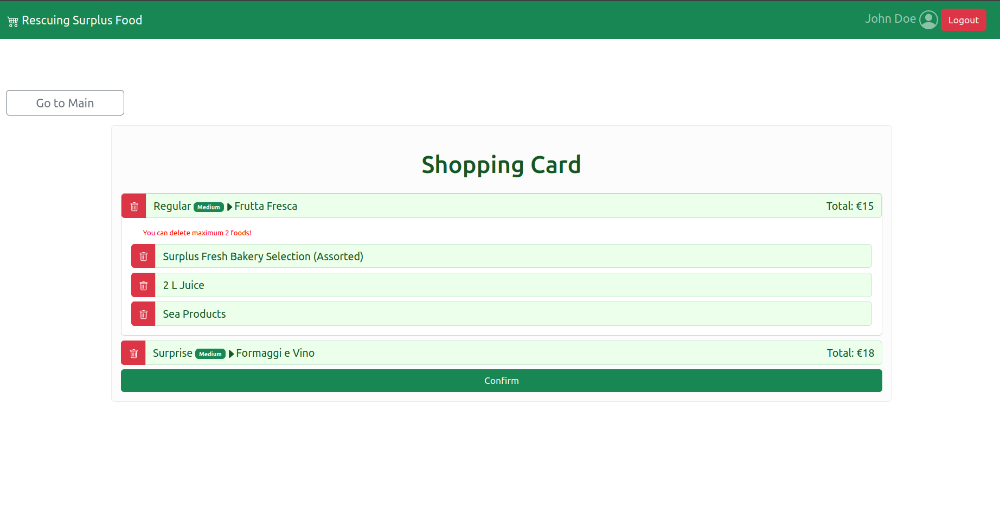

# Rescuing Surplus Food

> :warning: **This is only demo version and does not support multi client concept**

# Server side

## API Server

- POST `/api/login`
  - request parameters and request body content: username/password
  - response body content: user->id/name/email/
- GET `/api/establishments`
  - request parameters: none
  - response body content: list of establishments.
- GET `/api/schedules/:scheduleId`
  - request parameters: scheduleId
  - response body content: get schedule by id.
- GET `/api/:userId/reserved-bags`
  - request parameters: userId
  - response body content: list of bags reserved by user.
- POST `/api/bags-selected`
  - request parameters and request body content: list of selected bag ids.
  - response body content: list of bags selected.
- PUT `/api/bags/:bagId`
  - request parameters and request body content: bagId.
  - response body content: update bags data(available to reserved).
- PUT `/api/schedules/:scheduleId`
  - request parameters and request body content: scheduleId for update.
  - response body content: update schedules user_id change, put pick up time.

## Database Tables

- Table `users` - contains 10 users
- Table `establishments` - contains 10 establishments(stores/restaurants) name/address/phone number/type
- Table `bags` - contains 60 bags with type/size/content/state/price
- Table `schedules` - contains 60 schedules bagId, userId, establishmentId, pickupTime.

# Client side

## React Client Application Routes

- Route `/`: <Layout user={user} setUser={setUser} show={show} />
- Route index : <EstablishmentList establishments={establishments} user={user} setTitle={setTitle} orders={orders} />
- Route `/bags`: <BagsPage establishments={establishments} user={user} setTitle={setTitle} setBags={setBags} />
- Route `/bags/:idEstablishment` : <BagsList bags={bags} title={title} user={user} setOrders={setOrders} setEstablishments={setEstablishments} establishments={establishments} orders={orders} />
- Route `/:idUser/shopping-card`: <ShoppingCard orders={orders} setOrders={setOrders} establishments={establishments} setEstablishments={setEstablishments} user={user} setShow={setShow} show={show}/>
- Route `/:idUser/reserved-bags`: <ReservedBags user={user} />
- Route `/login`: <Login setUser={setUser} />
- Route `*`: <PageNotFound />

## Main React Components

- `ListOfEstablishments` (in `EstablishmentList.js`)

## Example Screenshot

## Users Credential Samples

- john.doe@example.com, pa$$word 
- jane.smith@example.com, StrongPass123
___
## Run Commmand

cd ./client && npm install && npm audit fix --force && npm run dev[build]
cd ./server && npm install && npm audit fix --force && nodemon ./index.js
